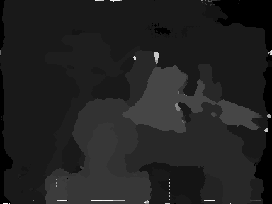
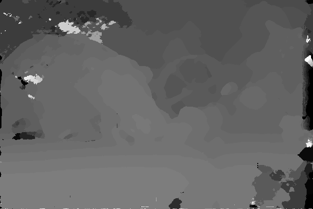
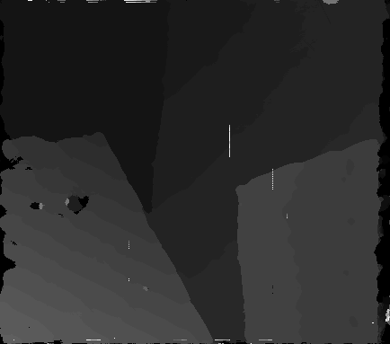
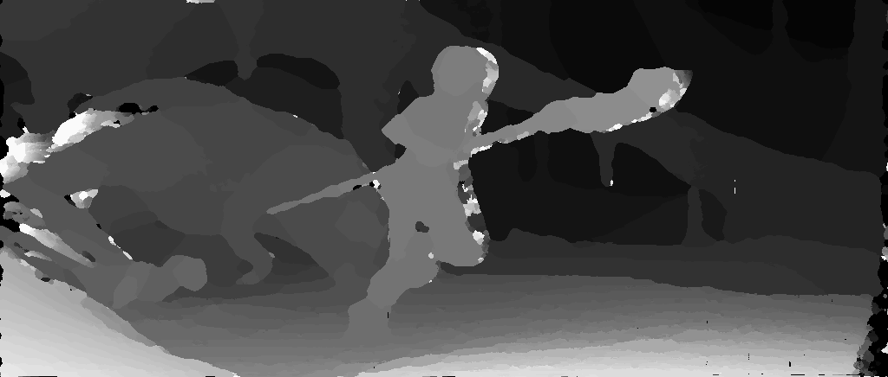
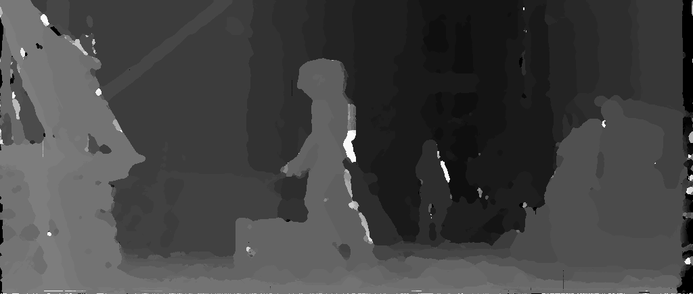
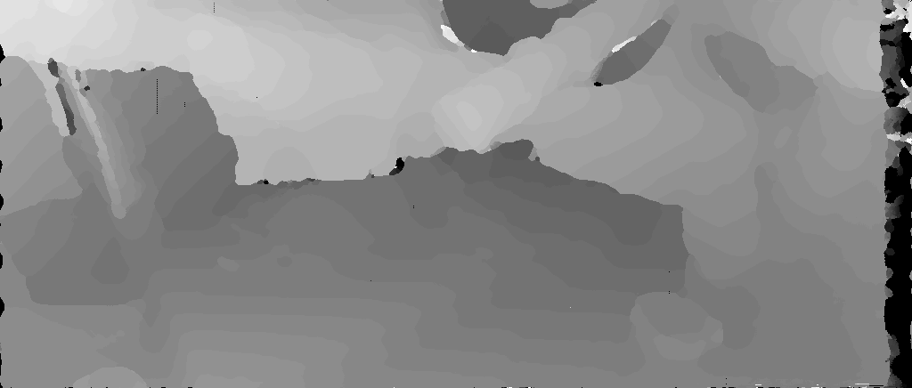
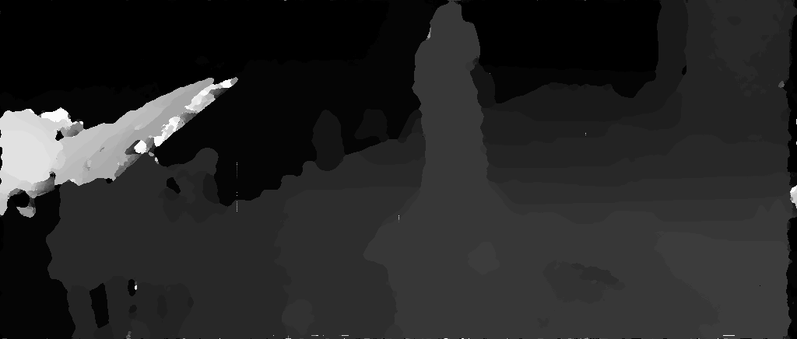

# SGM_impl

This is an implementation of Semi Global Matching (SGM) using the message passing algrithm which corresponds to my solution of a lab course in University of Freiburg. Result disparity maps are included.

## Key idea

- Inward pass (by dynamic programming)
- Outward pass (again by dynamic programming)
- Combination of messages

## Benchmark

tsukuba | couch | venus | 1_img | 2_img | 3_img | 4_img | 5_img | 6_img | 7_img
-- | -- | -- | -- | -- | -- | -- | -- | -- | --
5.531s | 15.626s | 15.679s | 24.121s | 25.296s | 24.203s | 26.486s | 22.608s | 28.027s | 23.222s

## Disparity maps

tsukuba | couch
-- | -- | -- 
  | 

venus | 1-img
-- | -- | -- 
  | 

2-img | 3-img
-- | -- | -- 
  | 

4-img | 5-img
-- | -- | -- 
  | 

6-img | 7-img
-- | -- | -- 
  | 

## References

- [Drory, Amnon, et al. "Semi-global matching: a principled derivation in terms of message passing." German Conference on Pattern Recognition. Springer, Cham, 2014.](https://link.springer.com/chapter/10.1007/978-3-319-11752-2_4)
- [Hirschmüller, Heiko. "Semi-global matching-motivation, developments and applications." Photogrammetric Week 11 (2011): 173-184.](http://elib.dlr.de/73119/)
